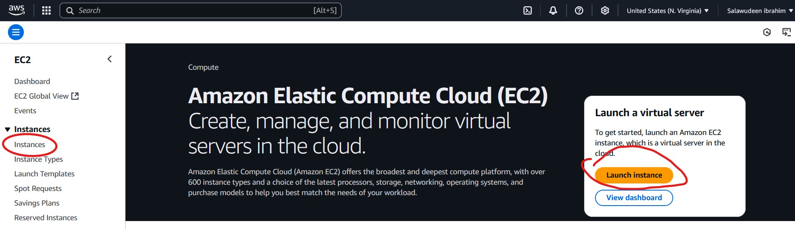
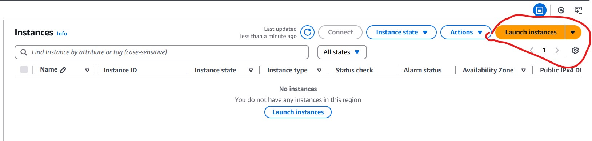
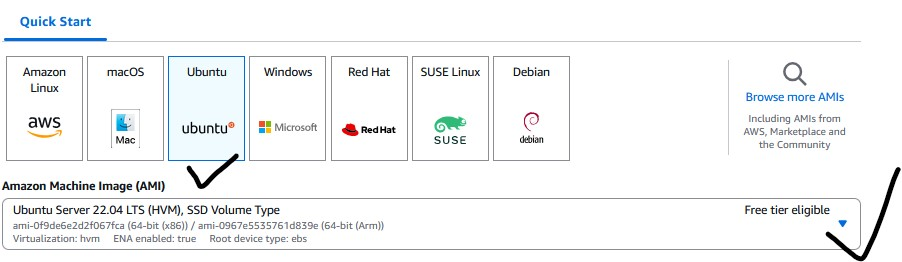
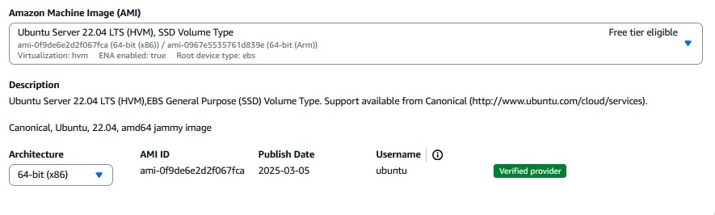
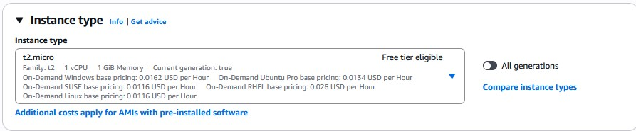
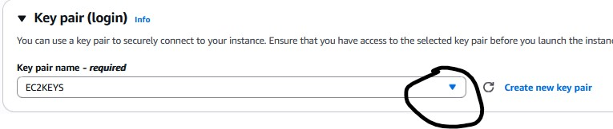
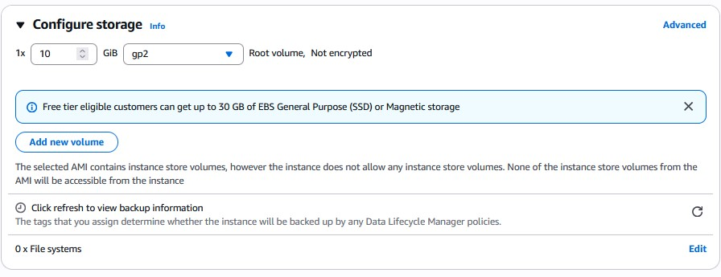

# DevOps Lab 1 : Provision Ubuntu 22.0.4 EC2 Instance | How to create EC2 instance in AWS console | Launch Ubuntu 22.0.4 instance in AWS

## Introduction4

Welcome to my first lab exercise! In this project, I'm creating a basic infrastructure on AWS by provisioning two EC2 instances. These virtual machines will be used to install and configure Jenkins and Apache Tomcat.

This setup is the foundation for future DevOps practices, including continuous integration and continuous deployment (CI/CD).

## What is EC2 instance? 

It is virtual server provided by AWS. I will be using this EC2 to setup both Jenkins and Tomcat. Please follow the below steps to create an EC2 instance.

## Prerequisites

Before you begin, ensure the following:

- You have an [AWS account](https://aws.amazon.com/).

## Steps

1. To launch an EC2 instance, log in to the AWS Management Console and click on **“Launch Instance”** under the EC2 dashboard.

  

    
    
⬅️ Step 2: Search for EC2

  

  

    
    
⬅️ Step 3: Click “Launch Instance”

  

 

2.  **Enter Name as EC2 Instance** and enter 2 as number of instances (one for Jenkins and another for Tomcat)

  

    
    
⬅️ Step 2: Write instance name - EC2 Instance

  

  

    
    
⬅️ Step 3: Click “Setup EC2”

  

3. Select **Ubuntu**

4. Choose **Ubuntu server 22.0.4** as AMI

5. Enter **t2.small** as instance type

6. Click on **Create new Key Pair**

  

    
    
⬅️ Step 2: Create a new key

  

  

    
    
⬅️ Step 3: Click “create”

  

  

    
    
⬅️ Step 4: Key pair login

  

7. Choose the existing key pair if you have one, otherwise create new one, give some name as myJenkinsKey. Make sure you download the key in your local machine. Please do NOT give space or any character while naming the key.

8. Under Network settings, **Click Edit**

  

    
    
⬅️ Step 2: Click “Edit”

  

  

    
    
⬅️ Step 3: network settings

  

- Add port range as **8080** and select **AnyWhere** as Source Type, that should enter **0.0.0.0/0** as Source

  

    
    
⬅️ Step 2: Add security group

  

  

    
    
⬅️ Step 3: network settings

  

 
9. Enter **10 GB** as storage

    
11. And then make sure in Summary, values appear as below:

  

    
    
⬅️ Step 2: Summary with one EC2 instance

  

  

    
    
⬅️ Step 3: Summary with two EC2 instance

  

  
12. Click on Launch Instance.

  
  
⬅️ Step 3: Click <strong style="color: green;">“Launch Instance”</strong>

- Click on **View instances**

Click Image to view more images

  

    
    
⬅️ Step 2: Setting Up

  

  

    
    
⬅️ Step 3: Successful Confirmation launch

  

  

    
    
⬅️ Step 4: View Instance

  

<!-- Notification placeholder -->

13 🔧 Renaming the EC2 Instance to **Jenkins** or **Tomcat**

### Steps:

- Hover your mouse over the **EC2 instance name** in the **Instances** list.
- A small **pencil icon** (✏️) will appear next to the name.
- Click the **pencil icon**.
- Type the new name, such as **Jenkins** or **Tomcat**.
- Press **Enter** or click **Save** to confirm the change.

 
 
  
⬅️ Step 2: Edit name
 
 
  
⬅️ Step 3: Changed name
 
 

  

