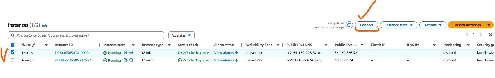
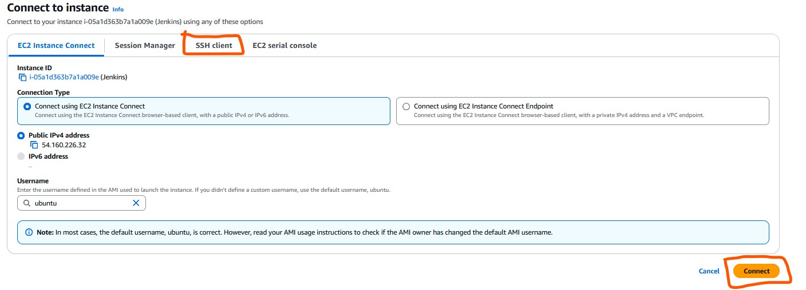
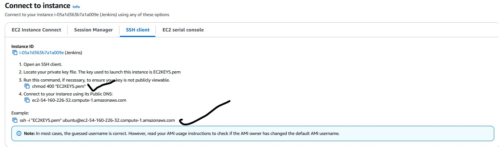
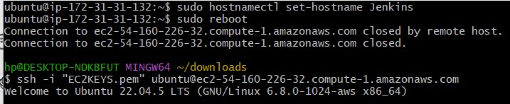
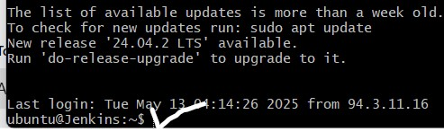

# DevOps Lab 1 : Provision Ubuntu 22.0.4 EC2 Instance | How to create EC2 instance in AWS console | Launch Ubuntu 22.0.4 instance in AWS

## Introduction4

Welcome to my first lab exercise! In this project, I'm creating a basic infrastructure on AWS by provisioning two EC2 instances. These virtual machines will be used to install and configure Jenkins and Apache Tomcat.

This setup is the foundation for future DevOps practices, including continuous integration and continuous deployment (CI/CD).

## What is EC2 instance? 

It is virtual server provided by AWS. I will be using this EC2 to setup both Jenkins and Tomcat. Please follow the below steps to create an EC2 instance.

### Prerequisites

Before you begin, ensure the following:

- You have an [AWS account](https://aws.amazon.com/).

## Steps

1. To launch an EC2 instance, log in to the AWS Management Console and click on **“Launch Instance”** under the EC2 dashboard.

<div style="display: flex; gap: 10px; align-items: flex-start;">
  <div style="text-align: center;">
    
    <p>⬅️ Step 1: Search for EC2</p>
  </div>
  <div style="text-align: center;">
    
    <p>⬅️ Step 2: Click “Launch Instance”</p>
  </div>
</div>

<br>


2.  **Enter Name as EC2 Instance** and enter 2 as number of instances (one for Jenkins and another for Tomcat)

<div style="display: flex; gap: 10px; align-items: flex-start;">
  <div style="text-align: center;">
    
    <p>⬅️ Step 1: Write instance name - EC2 Instance</p>
  </div>
  <div style="text-align: center;">
    
    <p>⬅️ Step 2: Click “Setup EC2”</p>
  </div>
</div>

3. Select **Ubuntu**


4. Choose **Ubuntu server 22.0.4** as AMI


5. Enter **t2.small** as instance type


6. Click on **Create new Key Pair**

<div style="display: flex; gap: 10px; align-items: flex-start;">
  <div style="text-align: center;">
    
    <p>⬅️ Step 1: Create a new key</p>
  </div>
  <div style="text-align: center;">
    
    <p>⬅️ Step 2: Click “create”</p>
  </div>
  <div style="text-align: center;">
    
    <p>⬅️ Step 3: Key pair login</p>
  </div>
</div>


7. Choose the existing key pair if you have one, otherwise create new one, give some name as myJenkinsKey. Make sure you download the key in your local machine. Please do NOT give space or any character while naming the key.


8. Under Network settings, **Click Edit**

<div style="display: flex; gap: 10px; align-items: flex-start;">
  <div style="text-align: center;">
    
    <p>⬅️ Step 1: Click “Edit”</p>
  </div>
  <div style="text-align: center;">
    
    <p>⬅️ Step 2: network settings</p>
  </div>
</div>

- Add port range as **8080** and select **AnyWhere** as Source Type, that should enter **0.0.0.0/0** as Source

<div style="display: flex; gap: 10px; align-items: flex-start;">
  <div style="text-align: center;">
    
    <p>⬅️ Step 1: Add security group</p>
  </div>
  <div style="text-align: center;">
    
    <p>⬅️ Step 2: network settings</p>
  </div>
</div>
 
9. Enter **10 GB** as storage


    
11. And then make sure in Summary, values appear as below:

<div style="display: flex; gap: 10px; align-items: flex-start;">
  <div style="text-align: center;">
    
    <p>⬅️ Step 1: Summary with one EC2 instance</p>
  </div>
  <div style="text-align: center;">
    
    <p>⬅️ Step 2: Summary with two EC2 instance</p>
  </div>
</div>
  
12. Click on Launch Instance.

<div style="text-align: center;">
  
  <p>⬅️ Step 3: Click <strong style="color: green;">“Launch Instance”</strong></p>
</div>


- Click on **View instances**

<p>Click Image to view more images</p>

<style>
  .zoom-on-hover {
    cursor: pointer;
    transition: transform 0.4s ease;
  }

  .zoom-on-hover:hover {
    transform: scale(1.2);
    z-index: 5;
  }

  .step {
    text-align: center;
  }
</style>

<div class="container" style="display: flex; gap: 10px; align-items: flex-start;">
  <div class="step visible" id="step1">
    
    <p>⬅️ Step 1: Setting Up</p>
  </div>

  <div class="step" id="step2" style="display: none;">
    
    <p>⬅️ Step 2: Successful Confirmation launch</p>
  </div>

  <div class="step" id="step3" style="display: none;">
    
    <p>⬅️ Step 3: View Instance</p>
  </div>
</div>

<!-- Notification placeholder -->
<p id="notify" style="font-weight: bold; color: green; margin-top: 20px;"></p>

<script>
  function rotateAndShow(nextId, currentImg) {
    // Add temporary rotation
    currentImg.style.transform = "rotateY(180deg) scale(1.2)";

    setTimeout(() => {
      const nextStep = document.getElementById(nextId);
      if (nextStep) {
        nextStep.style.display = "block";
      }

      // Reset transform to allow repeated animations
      currentImg.style.transform = "none";

      if (nextId === 'step3') {
        document.getElementById('notify').innerText = "✅ Click 'View Instances' to continue";
      }
    }, 600);
  }
</script>


13 🔧 Renaming the EC2 Instance to **Jenkins** or **Tomcat**

### ✅ Steps:

- Hover your mouse over the **EC2 instance name** in the **Instances** list.
- A small **pencil icon** (✏️) will appear next to the name.
- Click the **pencil icon**.
- Type the new name, such as **Jenkins** or **Tomcat**.
- Press **Enter** or click **Save** to confirm the change.

<style> .zoom-container { display: flex; gap: 10px; align-items: flex-start; } .zoom-image { transition: transform 0.3s ease; cursor: zoom-in; } .zoom-image:hover { transform: scale(1.5); z-index: 10; } </style> <div class="zoom-container"> <div style="text-align: center;">  <p>⬅️ Step 1: Edit name</p> </div> <div style="text-align: center;">  <p>⬅️ Step 2: Changed name</p> </div> </div>


## <p align="center"><strong>🔌 How to Connect EC2 Instance Using Git Bash (Windows) or iTerm2 (macOS)</strong></p>

After launching your EC2 instance, you’ll need to connect to it via SSH to start setting up Jenkins or Tomcat. Below are step-by-step instructions.

Prerequisites

1. On Windows, download and install Git Bash

2. On macOS, use the built-in Terminal or iTerm2

3.  Ensure you have downloaded your EC2 private key file (e.g., EC2KEYS.pem)

### ✅ Steps to Connect

#### Locate Your EC2 Instance in AWS

- Go to the EC2 dashboard in the AWS console

- Select the EC2 instance you want to connect to (e.g., Jenkins)

- Click Connect at the top



#### Use the SSH Client Option

- Under Connection method, choose SSH client



- AWS will show a sample SSH command you can copy and use in your terminal
  


#### Open Terminal and Navigate to Key File

- Open Git Bash (Windows) or Terminal/iTerm2 (macOS), then change directory to where your .pem key is saved. i.e Open the git bash on your system and cd to the folder you download the EC2KEYS.pem (mine is downloads)

<style> .zoom-container { display: flex; gap: 10px; align-items: flex-start; } .zoom-image { transition: transform 0.3s ease; cursor: zoom-in; } .zoom-image:hover { transform: scale(1.5); z-index: 10; } </style> <div class="zoom-container"> <div style="text-align: center;">  <p>⬅️ Step 1: Download folder</p> </div> <div style="text-align: center;">  <p>⬅️ Step 2: cd inside downdload folder </p> </div> </div>

```bash
cd Downloads   
```
- Check that your key file is there:
  
  ```bash
  ls -al EC2KEYS.pem 
  ```
- Result output

  ```Output
   -rw-r--r-- 1 hp 197121 1678 May 13 01:39 EC2KEYS.pem
  ```
- Set Correct Permissions for the Key

  To ensure SSH accepts the key file, restrict its permissions:
  
   ```bash
   chmod 400 EC2KEYS.pem
   ```

- Check again
  
  ```bash
  ls -al EC2KEYS.pem 
  ```
     ```Result
      -r-------- 1 hp 197121 1678 May 13 01:39 EC2KEYS.pem

      🔐 Note: SSH will not connect if your key file is publicly viewable.
     ```

- Connect to the EC2 Instance
    Use the public DNS from your instance in the following command:
        ```bash
        ssh -i "EC2KEYS.pem" ubuntu@ec2-54-160-226-32.compute-1.amazonaws.com

        When prompted: Are you sure you want to continue connecting (yes/no)? - type (yes)
        ```
  
- Rename the EC2 Server to “Jenkins”
     After successfully connecting to the server, you can rename it for clarity:

      ```bash
       sudo hostnamectl set-hostname jenkins
      ```
- Reboot the Server to Apply the Change & Reconnect using the SSH command:

      

       Your terminal should now show:
            ```bash
            ubuntu@jenkins:~$
            ```
            ✅ You’ve successfully connected and renamed your EC2 instance

                    
        
      


