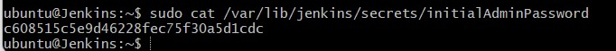

# Lab Exercise # 2 - CICD setup - Install Jenkins in One instance and Tomcat on second EC2 instance in AWS Cloud

Jenkins is an open source continuous integration/continuous delivery and deployment (CI/CD) automation software DevOps tool written in the Java programming language. It is used to implement CI/CD workflows, called pipelines
 
**follow the steps to install Java, Jenkins, Maven on Ubuntu 22.0.4 instance. Jenkins, Maven are Java based applications, so we need to install Java first.**

# Steps

## 1. 🔗 Connect to the Jenkins Instance from a Local Machine After Creating an EC2 Instance on AWS

- Open the AWS Console
   i) Navigate to **https://console.aws.amazon.com**.

   ii) Sign in to your AWS account.

- Locate Your **Jenkins EC2 Instance**

    i) From the AWS Console, go to the EC2 Dashboard.

    II) Click on Instances in the left-hand menu.

    iii) Find and select your Jenkins EC2 instance from the list.

  

- Click "Connect"

    i) With your Jenkins instance selected, click the “Connect” button at the top of the page.

- Choose "SSH Client" Option

    i) Under the "Connect to instance" page, select the SSH Client tab.

    ii) You will see an example SSH command provided by AWS (e.g., ssh -i "your-key.pem" ubuntu@ec2-XX-XX-XX-XX.compute-1.amazonaws.com).

- Prepare to Connect from Your Local Machine

   i) Open your terminal or command prompt on your local machine.

  ii) Change directory to where your .pem key file is downloaded.

  <style>
  .zoom-gallery {
    display: flex;
    align-items: center;
    gap: 1rem;
    justify-content: center;
    flex-wrap: wrap;
  }
  .zoom-image {
    width: 300px;
    cursor: pointer;
    transition: transform 0.3s ease;
    border-radius: 12px;
    box-shadow: 0 4px 12px rgba(0,0,0,0.2);
  }
  .zoom-image:hover {
    transform: scale(1.05);
  }

  /* Lightbox effect */
  #lightbox {
    position: fixed;
    display: none;
    top: 0; left: 0;
    width: 100%; height: 100%;
    background: rgba(0,0,0,0.9);
    justify-content: center;
    align-items: center;
    z-index: 1000;
  }
  #lightbox img {
    max-width: 90%;
    max-height: 90%;
    border-radius: 10px;
  }
</style>

<div class="zoom-gallery">
  
  <span style="font-size: 2rem;">➡️</span>
  
</div>

<div id="lightbox" onclick="this.style.display='none'">
  
</div>

<script>
  function showLightbox(src) {
    document.getElementById('zoomedImg').src = src;
    document.getElementById('lightbox').style.display = 'flex';
  }
</script>

## 2. 🛠️ Update the System

Before installing any packages, update the system’s package list to get the latest versions:

```bash
sudo apt update
```


## 3. ☕ Install Java 17

To install Java 17 on your Ubuntu system, run the following command:

```bash
sudo apt install openjdk-17-jdk -y
```
- Verify Java Version
  
```bash
java -version
```


## 4. 🛠️ Maven Installation
Maven is a popular build tool used for building Java applications. Maven is a popular build automation tool used primarily for Java projects. It helps manage project dependencies, builds, and documentation from a central piece of information.

To install Maven on Ubuntu, follow these steps:

```bash
sudo apt install maven -y
you can type mvn --version
```


## 5. 🧰 Jenkins Setup
Jenkins is an open-source automation server widely used in the field of DevOps and Continuous Integration/Continuous Deployment (CI/CD). It enables developers to automate parts of the software development process, 

- Building the code

- Testing it automatically

- Deploying to staging or production environments

### 🚀 Key Features of Jenkins:
- Open Source: Free to use with strong community support.

- Extensible: Offers thousands of plugins to integrate with virtually any tool in the CI/CD toolchain (e.g., Git, Docker, Kubernetes, Maven).

- Cross-Platform: Works on Linux, Windows, and macOS.

- Scalable: Can be configured for both small projects and enterprise-scale pipelines.

- Pipeline-as-Code: Supports Jenkinsfile (a text file that defines your CI/CD pipeline).

**i. Add Repository key to the system**

```bash
curl -fsSL https://pkg.jenkins.io/debian/jenkins.io-2023.key | sudo tee \
  /usr/share/keyrings/jenkins-keyring.asc > /dev/null
```

**ii. Append debian package repo address to the system**
```bash
echo deb [signed-by=/usr/share/keyrings/jenkins-keyring.asc] \
  https://pkg.jenkins.io/debian binary/ | sudo tee \
  /etc/apt/sources.list.d/jenkins.list > /dev/null
```


**iii. 🔄 Update Ubuntu Package List**
```bash
sudo apt update
```

### ⚙️ Install Jenkins
```bash
sudo apt install jenkins -y
```


### ✅ Verify if Jenkins Server is Running

After installation, confirm that the Jenkins service is active by checking its status:

```bash
sudo systemctl status jenkins
```


The above screenshot should confirm that Jenkins is successfully installed.

### 🌐 Access Jenkins via Web Browser

- Log into your AWS Console.
- Navigate to EC2 > Instances.
- Select the running instance where Jenkins is installed.
- Under the "Connect" tab, copy the Public DNS (IPv4) or Public IP.
- Open a web browser and enter the following URL (replace with your DNS or IP):

**📝 Note: Make sure port 8080 is open in the Security Group attached to your instance and add 8080 to the end of the URL.**

```text
http://<EC2_public_dns_name>:8080
```

<style>
  .image-row {
    display: flex;
    align-items: center;
    justify-content: center;
    gap: 30px;
    flex-wrap: wrap;
  }

  .image-box {
    text-align: center;
    position: relative;
    transition: transform 0.3s ease;
  }

  .image-box img {
    width: 400px;
    cursor: zoom-in;
    transition: transform 0.3s ease;
    border-radius: 12px;
    box-shadow: 0 4px 12px rgba(0, 0, 0, 0.15);
  }

  .image-box img:hover {
    transform: scale(1.8);
    z-index: 10;
  }

  .arrow {
    font-size: 40px;
    font-weight: bold;
    color: #555;
  }
</style>

<div class="image-row">
  <div class="image-box">
    
    <p>🔗 URL without Port</p>
  </div>

  <div class="arrow">➡️</div>

  <div class="image-box">
    
    <p>🌐 URL with Port 8080</p>
  </div>
</div>

### 🔓 Unlock Jenkins
Once you access Jenkins in your browser (via http://<EC2_public_dns_name>:8080), you will see a screen asking for an Administrator password.


**💻 To retrieve it, run the following command in your Ubuntu terminal (Git Bash or EC2 console)***

```bash
sudo cat /var/lib/jenkins/secrets/initialAdminPassword
```                       


**Copy the password and paste in the browser.**


**Then click on install suggested plug-ins.**

**Also create user name and password.**
**enter everything as admin. at least user name as admin password as admin**


**Click on Save and Finish.** 


**Click on start using Jenkins.**


**Now you should see a screen like below**


**Kudos!!!. Jenkins has been set up successfully by You.**

# Install Tomcat 9 on Ubuntu 22.0.4 | Setup Tomcat 9 on Ubuntu 22.0.4 in AWS EC2 | Setup Tomcat on Ubuntu

Apache Tomcat, often referred to as Tomcat, is an open-source implementation of the Java Servlet, JavaServer Pages (JSP), and Java Expression Language (EL) technologies. It serves as a web server and a servlet container, providing a platform for deploying and executing Java web applications. Tomcat is widely used in the Java development community for hosting Java-based web applications and supporting the execution of Java servlets and JSP pages.

Key Features and Components:

- Servlet Container:
  Tomcat functions as a servlet container, which means it implements the Java Servlet Specification. Servlets are Java classes that handle requests and generate responses for web applications.

-JSP Support:
 Tomcat supports JavaServer Pages (JSP), a technology that allows developers to embed Java code in HTML pages. JSP pages are compiled into servlets and executed by the servlet container.

- Connectors:
  Tomcat includes connectors that enable communication with different web servers, such as Apache HTTP Server or Microsoft IIS. The connectors facilitate integration with existing infrastructure.

- HTTP Server:
  While Tomcat is primarily known as a servlet container, it also includes a built-in HTTP server. This allows Tomcat to serve static content and handle HTTP requests directly.

- Manager Applications:
  Tomcat provides web-based management applications, such as the Tomcat Manager and Host Manager, which allow administrators to deploy, un-deploy, and manage web applications.

Tomcat Usage:

Web Application Deployment:

Tomcat is used to deploy and run Java web applications. Developers package their applications as WAR (Web Application Archive) files and deploy them to Tomcat.

Development and Testing:

Tomcat is commonly used during the development and testing phases of Java web applications. It provides a lightweight environment for testing servlets and JSP pages.


Integration with Other Technologies:

Tomcat is often integrated with other technologies, such as Apache HTTP Server or reverse proxy servers, to enhance performance and scalability.

Embedded Usage:

Tomcat can be embedded in Java applications, allowing developers to run a servlet container within their application.

## Pre-requisites:
Make sure you create brand new **EC2 instance** first for setting up Tomcat.
Also open **port 8080** in security firewall rules for EC2 instance in AWS

## Please follow below steps to install Tomcat 9 on Ubuntu 22.0.4.

**Change Host Name to Tomcat**
```bash
sudo hostnamectl set-hostname Tomcat
```
**Update to Latest packages**
```bash
sudo apt update
```
**Install Tomcat9**
```bash
sudo apt-get install tomcat9 tomcat9-docs tomcat9-admin -y
```


Setup an user in tomcat 
Open the tomcat-users.xml file by executing below command
sudo vi /var/lib/tomcat9/conf/tomcat-users.xml

**Perform below command for setting up tomcat admin app**
```bash
sudo cp -r /usr/share/tomcat9-admin/* /var/lib/tomcat9/webapps/ -v
```
**Setup an user in tomcat**
- Open the tomcat-users.xml file by executing below command
```bash
sudo vi /var/lib/tomcat9/conf/tomcat-users.xml
```

**You need to edit the file**
- vi or sudo vi to open a file editor and then press i or insert
- make the changes (avoid using mouse)
- press escape button
- :wq! (saving and exiting the file after changes)
- enter

Add tomcat user and assign to manager-script role.
Scroll down all the way to the end of the file,
Add the below lines in second last line above (above </tomcat-users>)

```bash
<role rolename="manager-script"/>
<user username="tomcat" password="password" roles="manager-script"/>
```
<style>
.image-row {
  display: flex;
  gap: 10px;
  justify-content: center;
  align-items: center;
}

.image-row img {
  width: 200px;
  height: auto;
  transition: transform 0.3s ease;
  cursor: pointer;
}

.image-row img:hover {
  transform: scale(1.2);
}
</style>

<div class="image-row">
  
  
</div>

**Now restart tomcat to take the changes in effect**

```bash
sudo systemctl restart tomcat9
```
**Verify if tomcat9 is working fine**

```bash
sudo systemctl status tomcat9
``` 


- Now press q for quitting from that window.
  
- Now open the browser to access Tomcat, enter
   **http://change to Ec2_public_dns_name:8080**
  


                                                      **That's it. You have setup Tomcat successfully!!**

