# Lab Exercise 03 - Create Java Web App using Maven & Setup Java WebApp in GitHub Repo

**How to setup SSH keys** | **How to setup Repo in GitHub and Setup Java Project in GitHub** | **How to add a Java Web App in GitHub using Maven**

GitHub is one of the popular git-based version control systems. GitHub is very good example for Software-as-a-service, hosted on cloud for storing and sharing code. 

- We will learn how to create a Java Project using Maven and push Java Project into GitHub from Ec2 instance. 
- Let us learn how to create SSH keys and securely connect to gitHub from EC2 instance.

**Pre-requisites:**
If you don't have an GitHub account, you need to create an account in github.com
- GitHub account
- Git client installed
- Connect to your Jenkins EC2 instance


## Step 1 - Create private repository in GitHub

- Go to https://github.com/
- Click on New to create a new repo 
- Also choose initialise with repository with a README option.
  


## Step 2 Create SSH keys from your Jenkins EC2 machine

- Login to your Jenkins EC2 instance using Git bash. (**make sure you are connected to Jenkins instance**)
  **make sure you are connected to EC2 instance by ssh url.** 
- **Type ssh-keygen** (and then **click on enter four button times**, (**do not give any password**)).
   


- ssh-keygen command will generate two keys - public keys and private keys. (**We need to upload only the public keys into GitHub**).
- If you already have keys generated, you can use the existing key, you don't have to overwrite the existing key.
- copy the content of public key by executing below command in Git bash and type the code below to see the key(password)
   
  ```bash
  sudo cat ~/.ssh/id_rsa.pub
  ```


# Step 3 - Upload SSH Keys in GitHub
**Go to GitHub, click on Settings.**

<p align="center">
  <strong> 1: Open Settings</strong><br>
  <br>
  ⬇️
</p>

<p align="center">
  <strong> 2: Set up SSH</strong><br>
  
</p>

**Copy SSH keys Key section and then click on Add SSH key.**

<p align="center">
  <strong>Step 1: Create New SSH Key</strong><br>
  <a href="Assets/Images/newssh-key.jpg" target="_blank">
    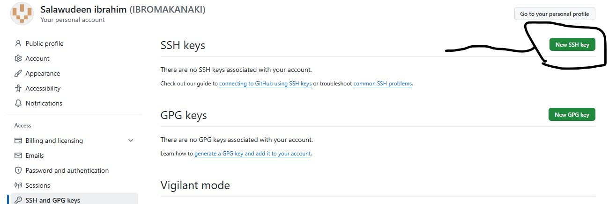
  </a><br>
  ⬇️
</p>

<p align="center">
  <strong>Step 2: Paste SSH Key</strong><br>
  <a href="Assets/Images/Paste-key.jpg" target="_blank">
    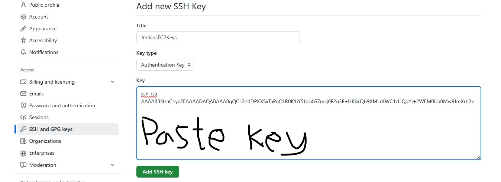
  </a><br>
  ⬇️
</p>

<p align="center">
  <strong>Step 3: Key Successfully Set</strong><br>
  <a href="Assets/Images/Key-set.jpg" target="_blank">
    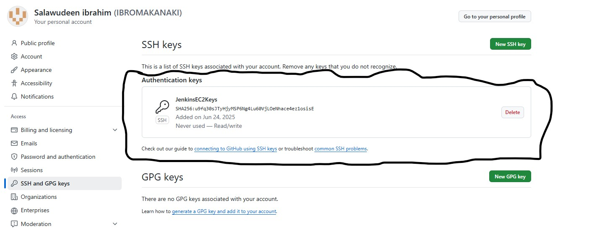
  </a>
</p>

## Step 4 - Clone Repo locally
Now click on the Cat icon on the top left to go back to repo you just created.
Click on the repo you created in **step 1**, **click on Code, under SSH**

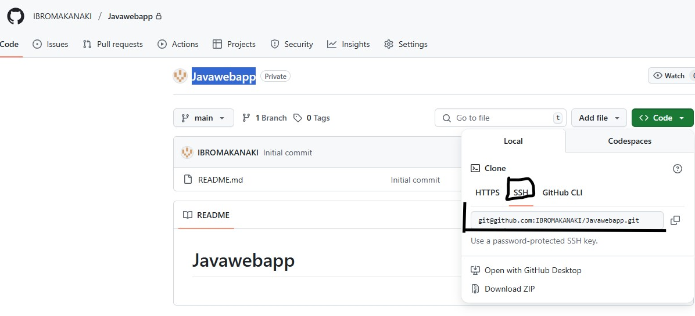


**Copy the SSH url and go to your EC2 instance using git bash and perform below command:**

```bash
git clone <paste the ssh url >
```
**type yes to connect**

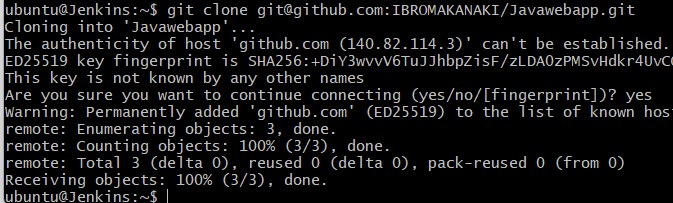

type below command to list the directory

```bash
cd Javawebapp
```
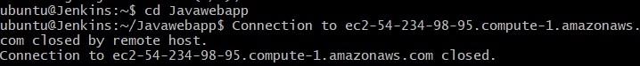

```bash
ls -al
```
The above command should list the directory you have cloned.

## Step 5 - Create Java Web App using Maven
use below maven command to create Java Web App using Maven. Maven is the build for creating and building java projects.

```bash
mvn archetype:generate -DgroupId=com.example.webapp \
                       -DartifactId=my-webapp \
                       -DarchetypeArtifactId=maven-archetype-webapp \
                       -DinteractiveMode=false
```

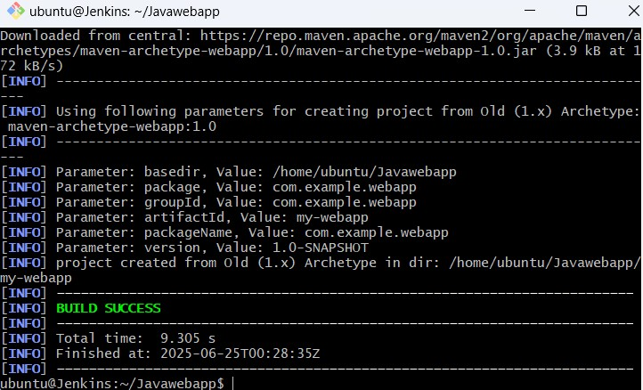

## Step 6 - Push Java Web App using Git commands into GitHub

type below command to see the new folder called MyWebApp

```bash
ls -al
```
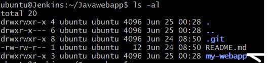

**type  below command to see the newly created project in red**

```bash
git status
```
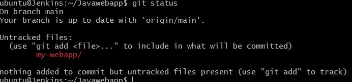

**Now add the newly created folder by executing below command:**

```bash
git add  *
```
**Now make sure all the files are moved to staging area, when you execute below command:**

```bash
git status
```
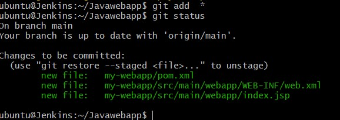

**Create global username and email address**

```bash
git config --global user.name "your github user_id"
git config --global user.email "youremailid"
```
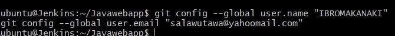

**Perform below command to commit the changes to local repository first.**
```bash
git commit -m "my first project check-in to GitHub"
```
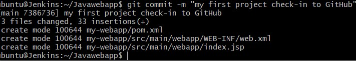

**Now perform below command to push from local repository to remote repository.**

```bash
git push
```
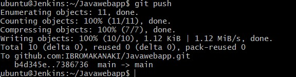

## Step 7 - Verify code changes in GitHub

**Now to GitHub and click on the repo, you will see your commits.**

<p align="center">
  <strong>Step 1: Push to Repo </strong><br>
  <a href="Assets/Images/Push 2.jpg" target="_blank">
    
  </a><br>
  ⬇️
</p>

<p align="center">
  <strong>Step 2: Repo </strong><br>
  <a href="Assets/Images/push1.jpg" target="_blank">
    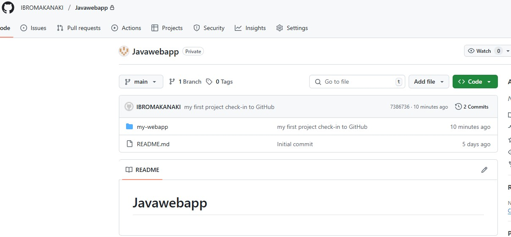
  </a>
</p>

