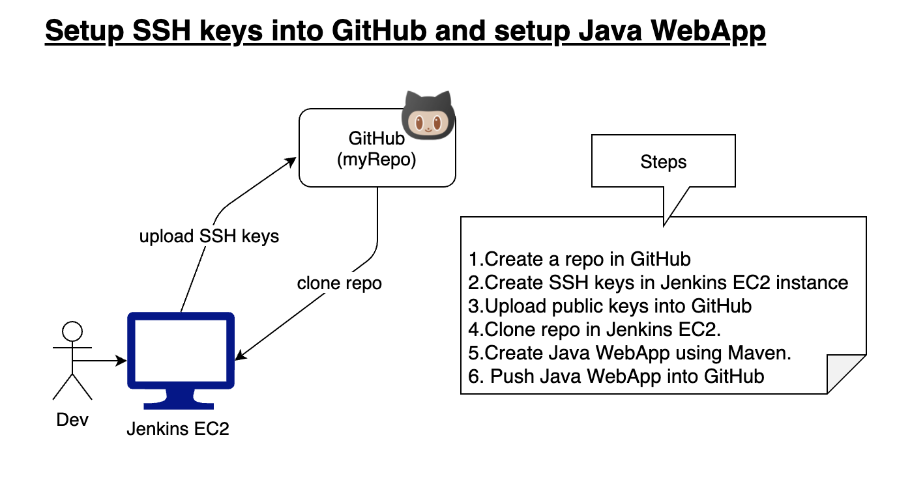
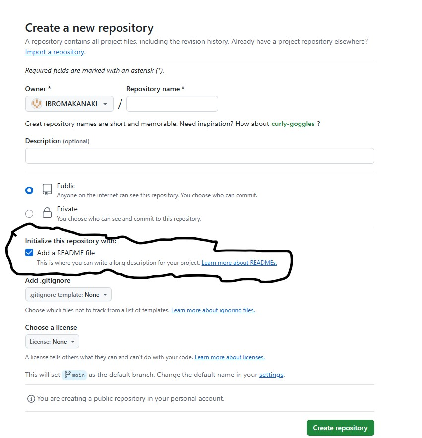
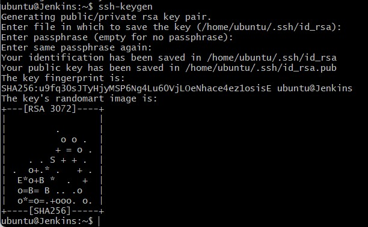
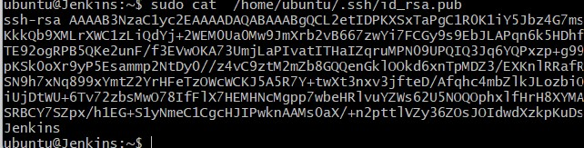
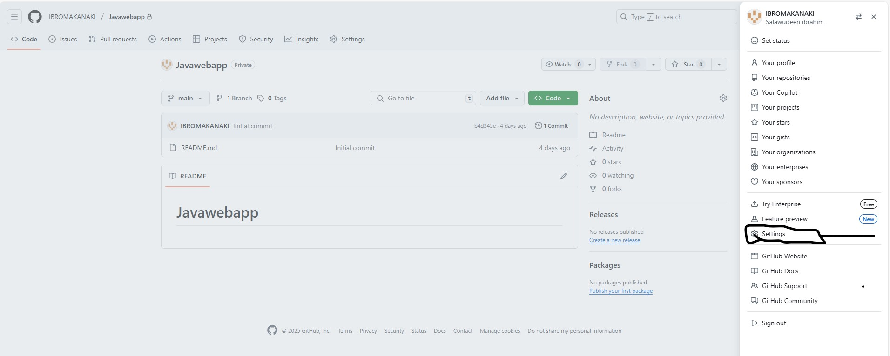
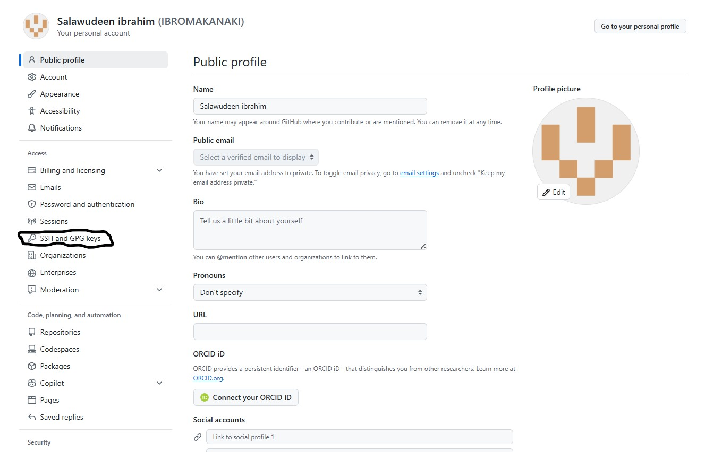

# Lab Exercise 03 - Create Java Web App using Maven & Setup Java WebApp in GitHub Repo

**How to setup SSH keys** | **How to setup Repo in GitHub and Setup Java Project in GitHub** | **How to add a Java Web App in GitHub using Maven**

GitHub is one of the popular git-based version control systems. GitHub is very good example for Software-as-a-service, hosted on cloud for storing and sharing code. 

- We will learn how to create a Java Project using Maven and push Java Project into GitHub from Ec2 instance. 
- Let us learn how to create SSH keys and securely connect to gitHub from EC2 instance.

**Pre-requisites:**
If you don't have an GitHub account, you need to create an account in github.com
- GitHub account
- Git client installed
- Connect to your Jenkins EC2 instance



## Step 1 - Create private repository in GitHub

- Go to https://github.com/
- Click on New to create a new repo 
- Also choose initialise with repository with a README option.
  


## Step 2 Create SSH keys from your Jenkins EC2 machine

- Login to your Jenkins EC2 instance using Git bash. (**make sure you are connected to Jenkins instance**)
  **make sure you are connected to EC2 instance by ssh url.** 
- **Type ssh-keygen** (and then **click on enter four button times**, (**do not give any password**)).
   


- ssh-keygen command will generate two keys - public keys and private keys. (**We need to upload only the public keys into GitHub**).
- If you already have keys generated, you can use the existing key, you don't have to overwrite the existing key.
- copy the content of public key by executing below command in Git bash and type the code below to see the key(password)
   
  ```bash
  sudo cat ~/.ssh/id_rsa.pub
  ```


# Step 3 - Upload SSH Keys in GitHub
**Go to GitHub, click on Settings.**

<p align="center">
  <strong>Step 1: Open Settings</strong><br>
  <br>
  ⬇️
</p>

<p align="center">
  <strong>Step 2: Set up SSH</strong><br>
  
</p>
